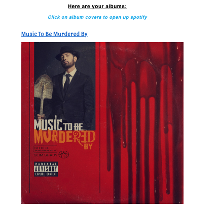

<h1>Albums4U<h1>

<h2>Live Page: <a href= "https://jyip01.github.io/Albums4U.github.io-Albums4U/">Albums4U</a><h2>

<h2>Screenshots</h2>

  
Main Page:

    

  
Results Page:

    

  
Linked Images:

    

<h2>About</h2>

Albums4U allows any user to search an artist of their choice and display's those album's name and cover images back to them. Along with those attributes it also allows a user to click on the album cover and open up a new tab to that album in Spotify, where they can listen to it.

<h2>Technologies used:</h2>
  <li>HTML</li>
  <li>CSS</li>
  <li>JavaScript</li>
  <li>Spotify API</li>
